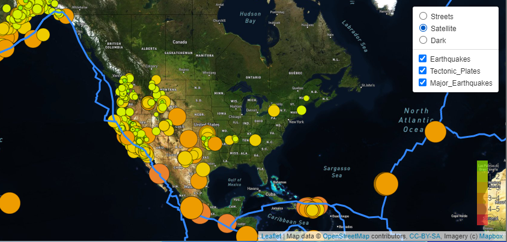

## Mapping_Earthquakes
Module 13

## Overview
The purpose of this project is to visually show the differences between the magnitudes of earthquakes all over the world for the last seven days. Earthquake data in relation to tectonic plates’ location on the earth, and earthquakes with a magnitude greater than 4.5 on the map are shown. In addition a third dark map is available. 

## Deliverables Met:
- Deliverable 1:Add Tectonic Plate Data
- Deliverable 2: Add Major Earthquake Data
- Deliverable 3: Add an Additional Map

      
